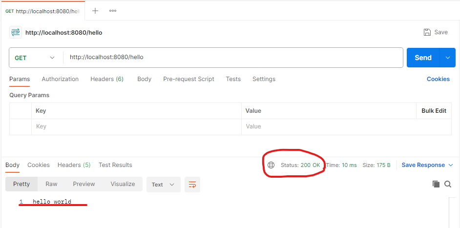
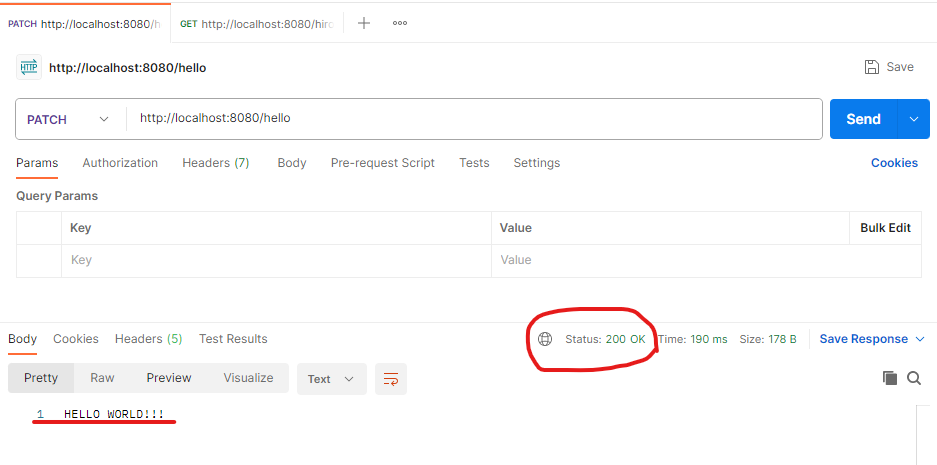
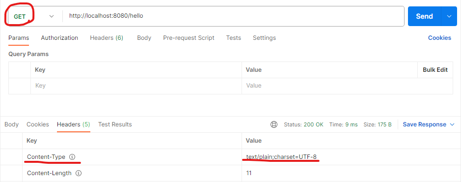
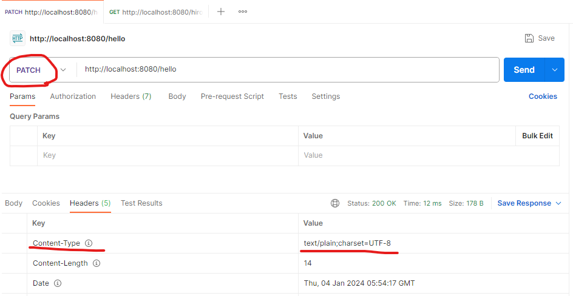
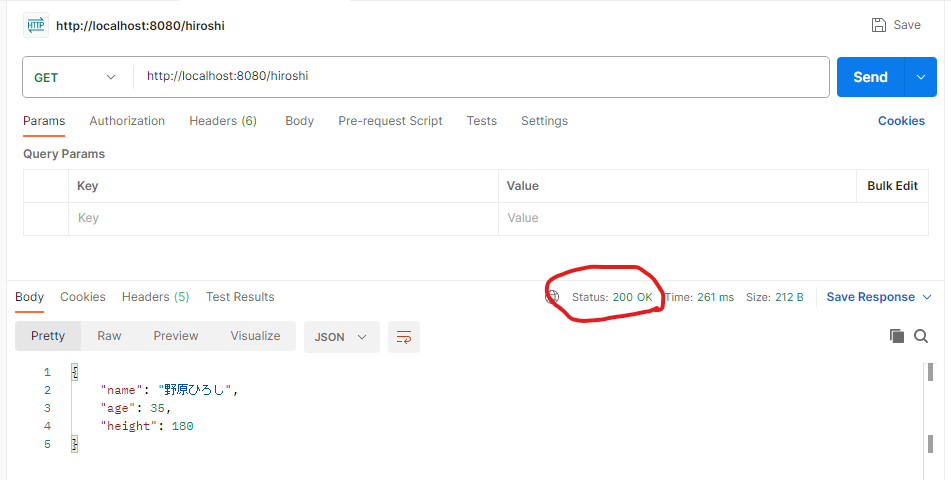
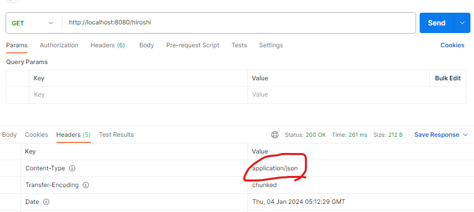

# このプロジェクトについて  
このプロジェクトでは初めて　Spring Boot　を使って　hello world　をレスポンスする　REST API　を作成します。  
  
### GETリクエスト   
GETリクエストで hello world を出力する REST API を作成しました。  
``http://localhost:8080/hello``  
下記画像ではPostmanを使い、レスポンスした結果を表示しています。  
ステータスコードは200が返ってきており、リクエスト処理に成功しています。  
  
  
### PATCHリクエスト  
GETリクエストで使用した REST API をそのまま使用し、リクエストをGETではなくPATCHで投げています。  
リクエストの結果をGETの時の「hello world」ではなく、「HELLO　WORLD!!!」にしたかったのでデータ変更のPATCHメソッドを使用しました。  
Postmanの結果が下記画像になります。  
ステータスコードも200で返ってきており、出力結果も「HELLO　WORLD!!!」に変っています。
  
  
### Content-Type　　
上記のGETリクエストとPATCHリクエストはコンテントタイプがテキストになっています。  
＜GETリクエストの結果＞  
  
＜PATCHリクエストの結果＞  
  
  
コンテントタイプをテキストではなくアプリケーションのものを作成しました。  
HelloControllerクラスの19行目からの記述とHiroshiクラスがコンテントタイプがアプリケーションのものになります。  
＜HelloControllerクラスの19行目からの記述＞  
```java
 @GetMapping("/hiroshi")
public Hiroshi getHiroshi() {
    return new Hiroshi("野原ひろし", 35, 180);
}
```  
Postmanの結果は下記画像のなります。  
ステータスコードも200で返ってきており、JSONもきれいに出力されています。  
コンテントタイプもアプリケーション/jsonになっています。  
REST API:``http://localhost:8080/hiroshi``
  

